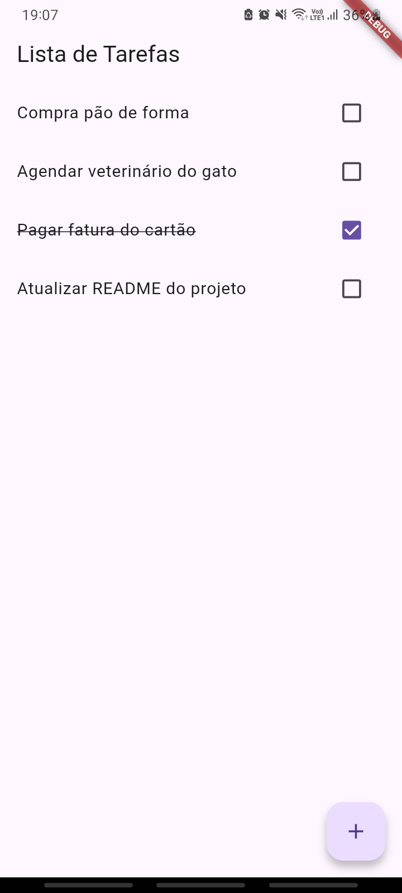
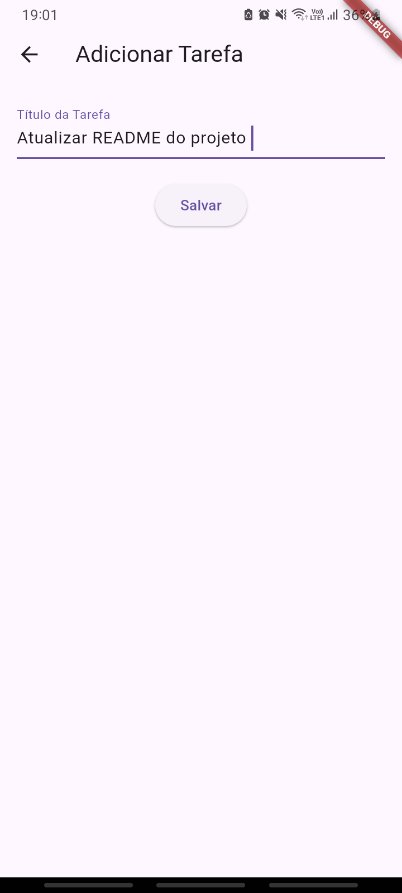

# 📱 Lista de Tarefas Flutter

Um aplicativo simples para gerenciar tarefas diárias, desenvolvido com Flutter.  
**Funcionalidades principais**:
- Adicionar novas tarefas
- Remover tarefas
- Marcar/desmarcar como concluída
- Persistência de dados local

---

## 🖼️ Telas do Aplicativo

| Tela Principal | Adicionar Tarefa |
|----------------|-------------------|
|  |  |

---

## ⚙️ Como Executar

### Pré-requisitos
- [Flutter SDK](https://docs.flutter.dev/get-started/install) instalado
- Dispositivo/emulador Android ou iOS configurado

### Passos
1. **Clone o projeto**:
   ```bash
   git clone https://github.com/AlissonGRN/flutter-todo-app.git
   ```

2. **Acesse a pasta do projeto**:
   ```bash
   cd todo_app
   ```

3. **Instale as dependências**:
   ```bash
   flutter pub get
   ```

4. **Execute o app**:
   ```bash
   flutter run
   ```